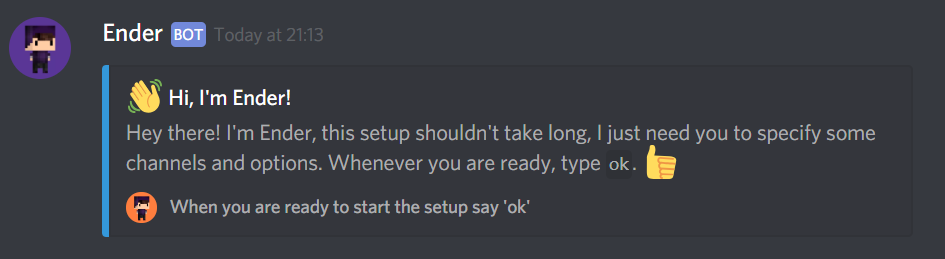

# 🔮 Introduction to Ender

## Getting started


This is for the bot only. If you want to read the documentation for the API, head over to https://docs.ender.site/api


To get started you'll want to head over to t[he invite page](https://discordapp.com/oauth2/authorize?client_id=371685425351229441&scope=bot&permissions=536341759&response_type=code&redirect_uri=https%3A%2F%2Fbot.ender.site%2Fthanks), then select which server you want to add Ender into, and click hit that shiny authorize button.

## 👏 Next 👏 Step 

Alright, now you're gunna setup the bot for your server. Make sure you have the following things ready before the setup!

* [ ] A join/leave channel
* [ ] A join role


Make sure you have all these setup & ready before continuing! If you mess up, you'll have to start the setup all over again.


## Let's do this.

Type that into your server and Ender will start the setup.

```text
!setup
```

_My goodness that was easy._



Just follow the setup and answer some simple questions.

## Boom, we're done here.

Alright chief, that's all done now. Enjoy using Ender in your server! 💪 


