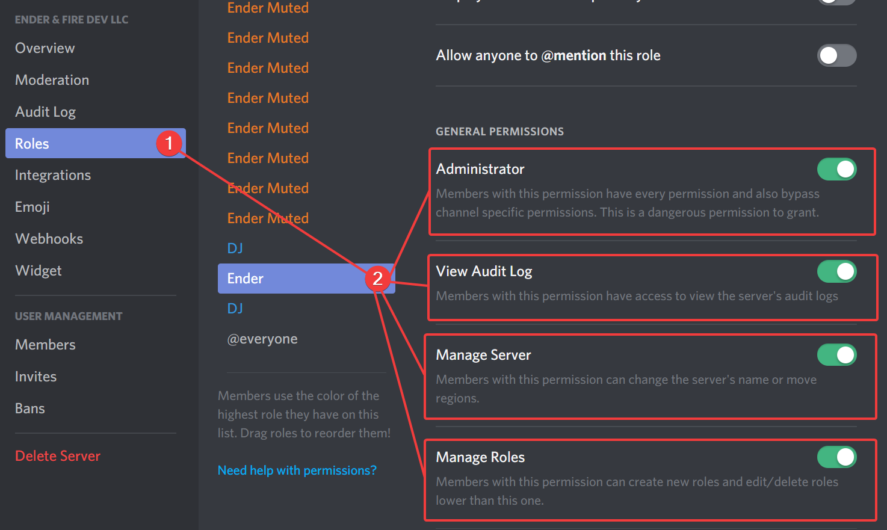

# 👀 Something happened

## 👏 Process 👏 Elimination

### Okay, so something isn't doing what you expected?

Please make sure you go through these important checks to make sure you didn't just do something stupid like removing permissions, now it ain't sending stuff.



## Check Permissions

It's very likely you probably setup permissions incorrectly. Let's make sure that's correct.

Head over to your Server Settings, click Roles, and then select 'Ender', this is Ender's role. Make sure Ender has these permissions...

* Administrator
* Manage Server
* View Audit Logs
* Manage Roles
* Manage Channels
* Kick Members
* Ban Members
* Create Instant Invite
* Change Nickname
* Manage Nicknames
* Read Text Channels & See Voice Channels
* Send Messages \[IMPORTANT\]
* Manage Messages
* Embed Links
* Attach Files
* Read Message History
* Mention Everyone
* Use External Emojis
* Add Reactions
* Connect
* Speak
* Mute Members
* Deafen Members
* Move Members
* Use Voice Activity

Also make sure the bot has access to the channel.

Once you've checked over all them, try run a command. If it works, congrats, you're done here.

#### If not, please continue to Step 2.



## Have you tried unplugging it, and plugging it back in again?

No, not literally, but you can do a similar process by, kicking our bot, and then re-inviting it. If the commands work again, amazing!

#### If not, continue to Step 2



## You can always contact us on Discord for support if you believe it isn't that serious.

You can join our Discord here: [https://discord.gg/wt2VukN](https://discord.gg/wt2VukN)



## So none of the above worked?

I suggest you open a issue on our GitHub repository. You can create a GitHub account in minutes, if you don't, join our Discord.

### Go to our [repo here](https://github.com/EnderAndFireDev/Ender), and click [Open Issue](https://github.com/EnderAndFireDev/Ender)

